# Homework 2 Documentation

**Name:** Danielle Moore
**Date:** 3/3/2026
**Course:** SWE 645 Spring 2026

---

## What I Built

I built a simple web application that serves as a student survey for prospective GMU students. The application is containerized using docker and deployed using a Kubernetes cluster with a Jenkins CI/CD pipeline running on an AWS EC2 instance.

## How It Works

The system comprises of the following components:

- Source code, dockerfile, kubernetes deployment and service yaml files, and jenkins file hosted in my GitHub repository.
- Docker container for my web application
- AWS EC2 Instance
- Kubernetes cluster managed by Rancher
- Jenkins CI/CD Pipeline to automate docker builds and deployment of kubernetes cluster

## Installation & Setup Instructions with CI/CD Pipeline Details & Kubernetes Deployment Details

### **1. Setup GitHub Repository**

- First, create a Github account on https://www.github.com. Once you are logged into your account, click on the green **"New"** button next to **"Top Repositories"** to create a new repository.
  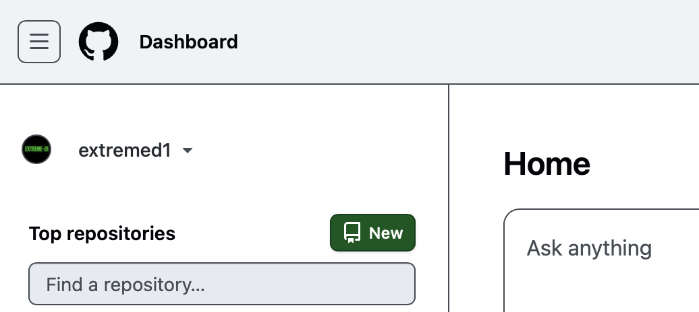
  - Provide a name for the repository (you can leave the rest at default configuration) and click the green **"Create repository"** button. The name of my repository is **Assignment2-SWE645**.

- Install **git** on your local machine. Use the documentation from https://git.scm.com/install/ to install git based on your operating system. I have git for macOS installed.
- Open VSCode on your local machine and open the folder containing your application files.

<div style="display: flex; justify-content: center; gap: 20px;">
  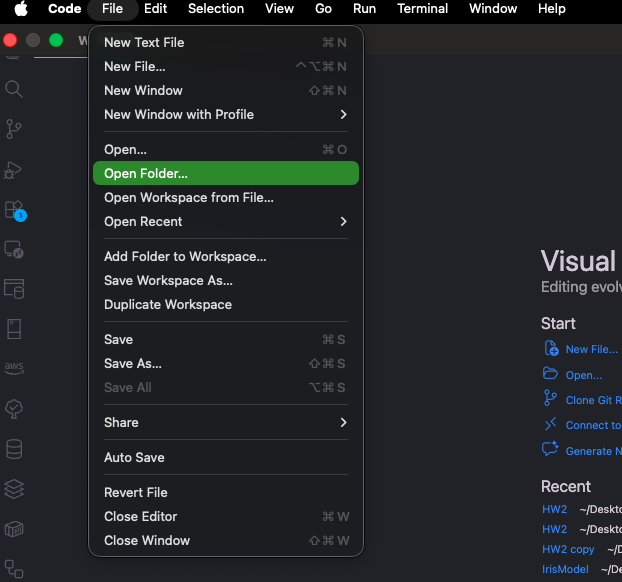
       
  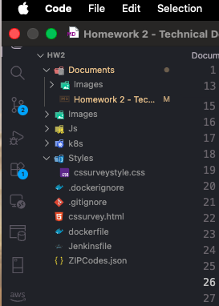
</div>

- Open your terminal and enter the following commands to initialize your local git repository:
  ```
  git init
  git add .
  git commit -m "initial comment"
  ```
- Once the local repository has been initialized, create a connection to the GitHub repository using the commands below:
  ```
  git remote add origin <YOUR GITHUB REPO LINK> #(I used https://github.com/extremed1/SWE-645-Projects.git)
  git push origin master
  ```
- Now all files on in your remote repo should be in your repository
  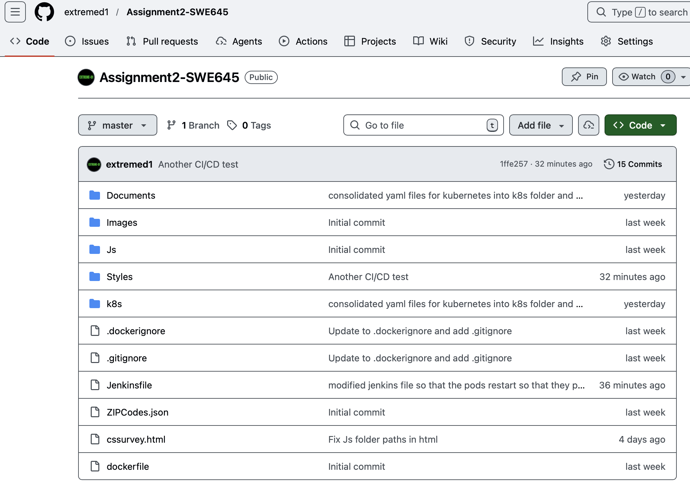

### **2. Launch EC2 Instance on AWS**

- In the search bar, type **EC2** and click on the 1st service listed
  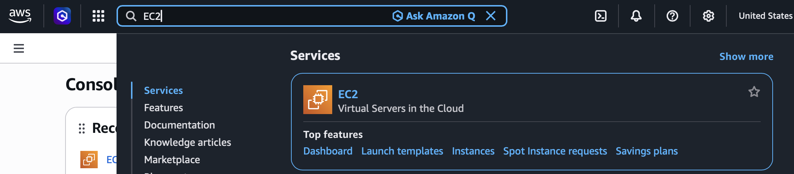

- On the left pane, scroll down to **Network & Security** and click on **Security Groups**. Then click the orange **Create security group** button.
  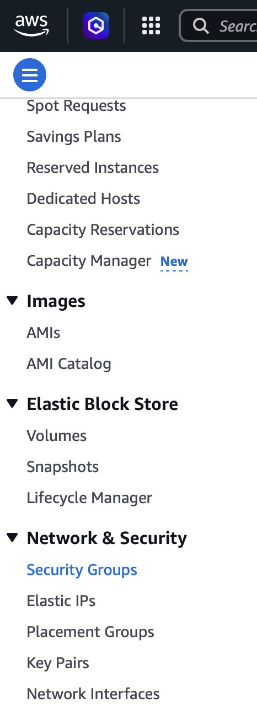

- Give the security group a name, and then fill out the inbound rules according to the screenshot below. The outbound rules should remain at the default configuration:
  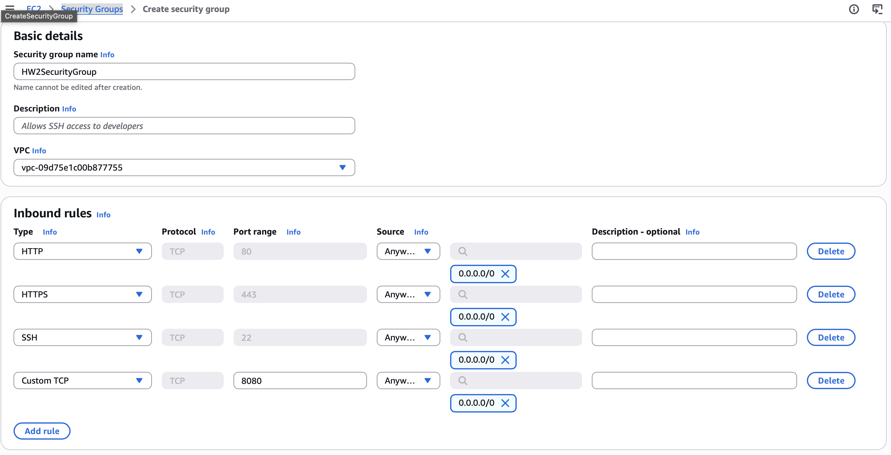

- After creating the security group, scroll to **Instances** in the pane, and click the orange **Launch instances** button.
- Provide a name for the instance, select the Ubuntu AMI (**Ubuntu Server 24.04 LTS (HVM), SSD Volume Type**), select the **t3.large** instance type, select the **Proceed without a key pair** option under Key pair (login) section, select the **Select existing security group** option under Network Settings and then select the security group you created (**HW2SecurityGroup**), then increase the storage to **30 GiB** under the **Configure storage** section. Then, click the orange **Luanch instance** button.

- Once the Instance state displays **Running** and all status checks have passed, scroll down to **Network & Security** on the left pane and select **Elastic IPs** to create an elastic IP to associate with the newly created EC2 instance.

- Click on the orange **Allocate Elastic IP address** button, then click on the orange **Allocate** button on the subsequent page. A green banner will appear at the top of your page asking if you want to associate the newly created elastic IP. Click **Associate the elastic IP**. Under Instance, chose the new EC2 instance, check the box that says **Allow this elastic IP address to be reassociated** ,then click the orange **Associate** button.

- The elastic IP address should now match the Public IPv4 address for the EC2 instance.

### **3. Installing Docker, Rancher, & Jenkins on the EC2 Instance**

To connect to the running EC2 instance, click the instance and click the **Connect** button. Connect to it using **EC2 Instance Connect**. Once you're in the terminal run the following command to log in as the root:

```
$ sudo su -
```

#### 1. Installing Docker

- Run the following command to install docker:
  ```
  $ apt-get update
  $ apt upgrade -y
  $ apt install docker.io
  ```

#### 2. Installing Rancher

- Run the following command to install rancher

  ```
  $ docker run --privileged -d --restart=unless-stopped -p 80:80 -p 443:443 rancher/rancher:stable
  ```

- Once the installation is completed, go back to the details page of your EC2 instance, click **open address** on the public IPv4 DNS address. This will take you to the rancher UI.

- Copy the password command from the UI page and paste it into your EC2 terminal. Copy the bootstrap password and paste it into the password box in the rancher UI page. Then log in.

#### 3. Installing & Setting Up Jenkins

- First, run the following command in your EC2 terminal to install java
  ```
  $ apt update
  $ apt install openjdk-17-jdk
  $ java --version
  ```
- Once java is installed, run the following command to install jenkins

  ```
  $ sudo wget -O /etc/apt/keyrings/jenkins-keyring.asc \
  https://pkg.jenkins.io/debian-stable/jenkins.io-2026.key
  echo "deb [signed-by=/etc/apt/keyrings/jenkins-keyring.asc]" \
    https://pkg.jenkins.io/debian-stable binary/ | sudo tee \
    /etc/apt/sources.list.d/jenkins.list > /dev/null
  $ sudo apt update
  $ sudo apt install jenkins
  ```

- To verify that jenkins is running, run the following command. You should see that it is **active** after running it.

  ```
  $ systemctl status jenkins
  ```

- Next, to set up your new jenkins installation, you need to open the jenkins UI page using http://your_ip_or_domain_dns:8080 mine is (http://3.90.194.124:8080).

- You'll need to get the initial admin password to log into Jenkins by running the following command in the EC2 terminal, and then pasting the result into the **Administrator password** field.
  ```
  $ $udo cat /var/lib/jenkins/secrets/initialAdminPassword
  ```
- Next, Jenkins will prompt you to install necessary plugins. On the next page, click on the **Install suggested plugins** box to get the basic plugins. The process will start immediately.

- Next, once the plugins are installed, you will be prompted to set up the first admin user. Fill out the all required information and then click **Save and Continue**. The next page will ask you to set the URL for your Jenkins instance. This will be automatically populated with the public IP address of your EC2 instance. Confirm that it matches, and click the **Save and Finish** button. Then, click on the **Start using Jenkins** button.

- Click on **Manage Jenkins** at the top of your dashboard (the setting symbol) and scroll to **Plugins**. Search for and install **Docker Pipeline** and **Kubernetes CLI**

### **4. Creating Docker Image and Pushing to Docker Hub**

- First, you'll need to create a DockerHub account on https://hub.docker.com. I already have one (xtremed1).

- You'll need to install docker desktop on your local machine from https://docs.docker.com/desktop based on your operating system. I already have it installed. I am using Docker Desktop for Mac. Once it is downloaded and installed, log into your docker hub account on docker desktop. This will allow you to build, share, and run your containers on your local machine.

- In VScode, install the **Docker** extension. Then create a file named **dockerfile**. Make sure your dockerfile is in the same folder as your html file. Note that the name of my html file is **cssurvey.html**.

- In the dockerfile, use the **FROM** command to get the base image for the build. I used nginx:alpine. I needed to remove the default html content in Nginx, so I used **RUN rm -rf /usr/share/nginx/html/\*** to do so. I copied all of my necessary folders. Then, I used a custom Nginx configuration to set cssurvey.html as default page. I exposed port 80 for the HTTP server using **EXPOSE 80**. Then, I used **CMD ["nginx", "-g", "daemon off;"]** to start Nginx when the container runs.

  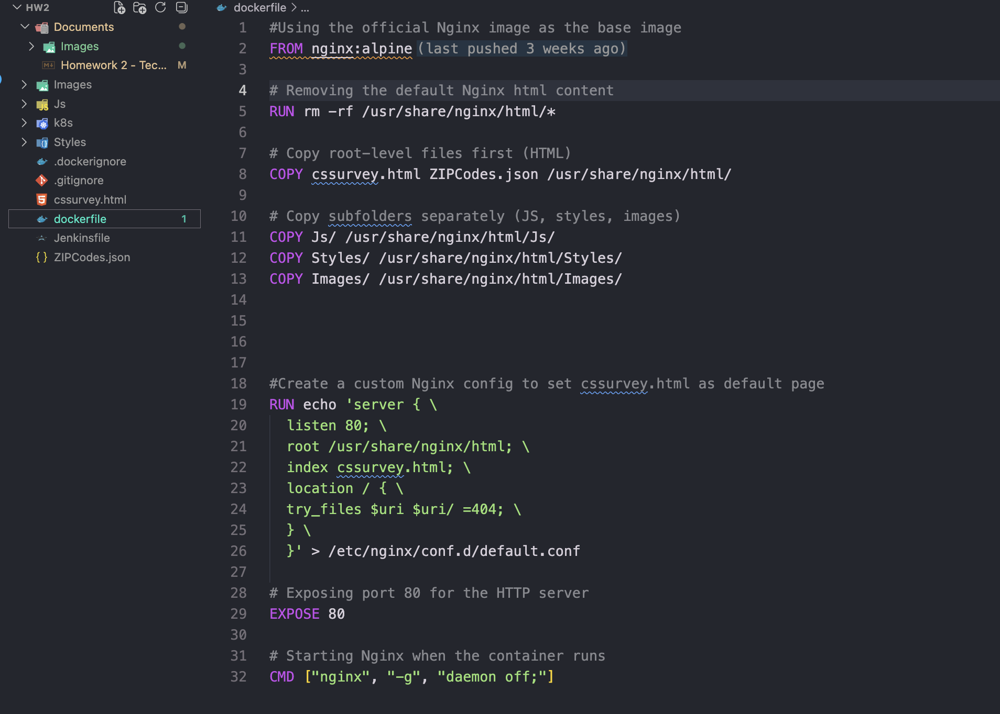

- Because I am building docker images on a Apple Silicon Mac (arm64), I will need to build a multi-architecture image so that it works on my Kubernetes nodes. I used the following commands to build the multi-architecture image:
  ```
  docker buildx build \
  --platform linux/amd64,linux/arm64 \
  -t xtremed1/my-survey:latest \
  .
  ```
- To test the container, run the following command:

  ```
  docker run --platform linux/arm64 -p 8080:80 xtremed1/my-survey:latest
  ```

  Then open a browser at http://localhost:8080/cssurvey.html to verify that the container is working properly.

- Once you confirmed that it works, run this command to build and push the image to docker hub:

  ```
  docker buildx build \
  --platform linux/amd64,linux/arm64 \
  -t xtremed1/my-survey:latest \
  --push \
  .
  ```

  Verify that the image is in Docker Hub to ensure that your image is accessible from the internet.

### **5. Creating Kubernetes Cluster**

- Open your rancher UI again using your public IPv4 address (mine is at at http://3.90.194.124). You should still be logged in. In the left menu pane, click on **Cluster Management**. Then, click on the **Create** button and select **Custom** under **Use existing nodes and create a cluster using RKE2/K3s** section.

<div style="display: flex; justify-content: center; gap: 20px;">
  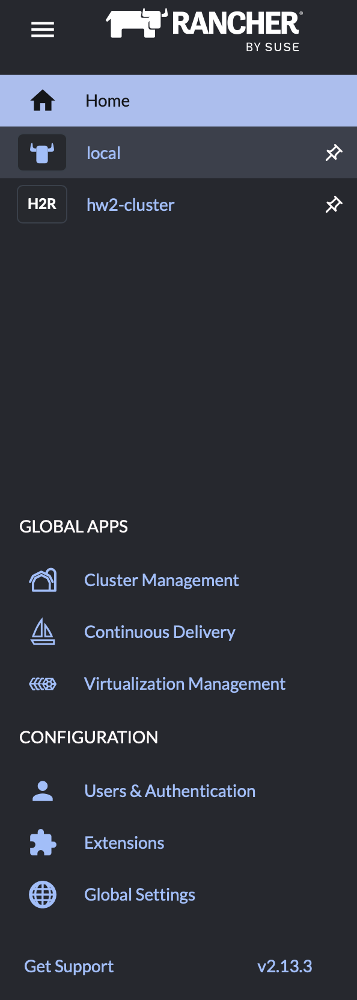
       
  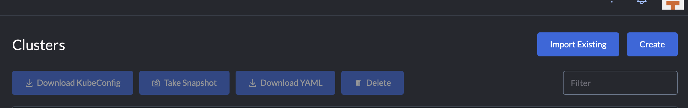

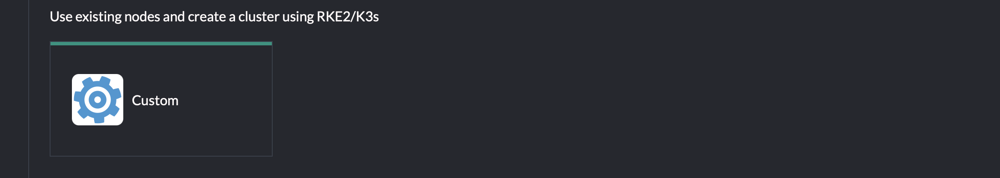

</div>

- On the next page, give the cluster a name (mine is hw2-cluster) and click **Create**. On the next page, select the 3 boxes under **Step 1**. Under **Step 2**, select the box for **insecure** and copy the given command in your ec2 instance terminal. Once the cluster is done, it will show **ACTIVE** and it is ready to deploy.

- Click on the cluster and copy the KubeConfig file to your clipboard.

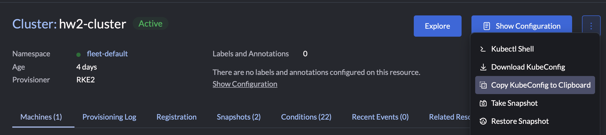

- In the terminal for the EC2 instance, run the following commands:

  ```
  $ mkdir -p ~/.kube
  $ vim ~/.kube/config
  ```

  1. press **"i"** to insert
  2. paste your copied KubeConfig file
  3. Press **esc**
  4. Type **":wq"**
  5. Run `kubectl get nodes` to check that your nodes are running

- To create your deployment and service yaml's, I used the Rancher UI. Click on the **Explore** button in the cluster (hw2-cluster), click **workloads**, then **deployments**. Click create and then provide a cluster name, add your docker image name, increase the number of replicas to **3**, select **Node Port** under the network settings, name the network **nodeport** and then enter **8080** for the private container port. Leave the listening port empty. Press create.

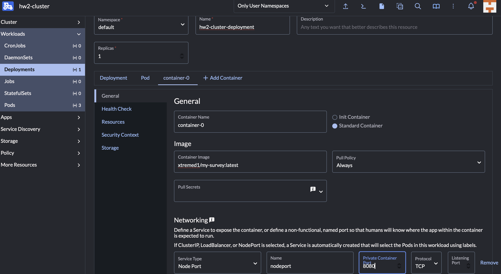

- Since my docker container is exposed on port **80**, I changed the target port to **80** instead of 8080. Once it was active, I selected the deployment (mine is hw2-cluster-deployment), then I selected **Services** . I clicked on **Edit YAML** on the **Node Port** service and changed the target port.

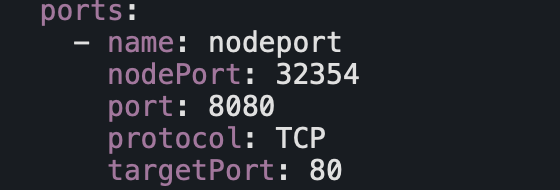

- You should be able to view your survey form on http://your_public_ip_or_public_dns:highportnumber/index.html (mine is http://3.90.194.124:32354/cssurvey.html )

### **6. Creating CI/CD Pipeline**

- First, configure your GitHub Repository on the EC2 instance. Run the following commands to create a directory named repos, initialize git, add your configuration, and clone your repository.

  ```
  $ mkdir repos
  $ cd repos
  $ git init
  $ git config --global user.name "Your Name" #I used "Danielle Moore"
  $ git config --global user.email "emailid@example.com" #I used "dannimoore17@gmail.com"
  $git clone https://git-clone-url.git #I used https://github.com/extremed1/Assignment2-SWE645.git
  ```

- You need to add an SSH key to your github account. So first generate an SSH key pair using the following command in your EC2 instance terminal:

  ```
  ssh-keygen -t rsa -b 4096 -C "your_email@example.com" #I used "dannimoore17@gmail.com"
  ```

  - follow the prompts to save the key. Then, run `id_rsa.pub` to locate your public key file. Open the public key file and copy the entire content of the file.

  - Log into your github account and go to **settings**. Click on **SSH and GPG keys** under **Access**. Click on **New SSH key**, give the the SSH key a **Title** (mine is **My swe 645 ec2 instance**), and paste your public key into the **Key** text area. Then, click **Add SSH key**.

  - You'll want to test the connection. To do so, run `ssh -T git@github.com`. Confirm the authenticity of the host. You should receive a successful authentication message.

- You'll need to put a deployment.yaml, service.yaml, and a Jenkinsfile in your github repository. For the deployment yaml, go to the rancher UI, click on your cluster, go to **Deployments**, click on the 3 dots next to **Show Configuration** and select **Download YAML**. For the services yaml, go to **Services** in the cluster, click on the 3 dots for the **Node Port** service and click **Download YAML**.

<div style="display: flex; justify-content: center; gap: 20px;">
  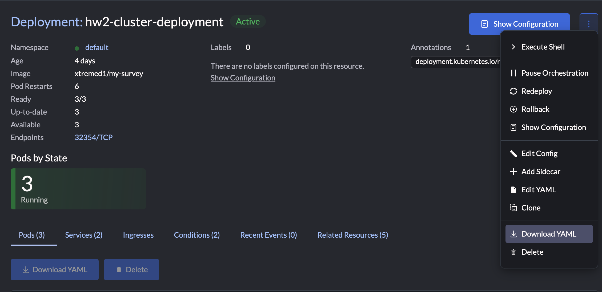
       
  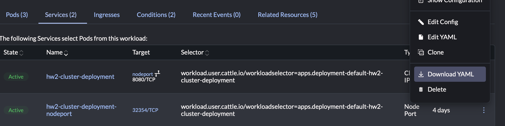
</div>

- In your project folder in VSCode, create a new folder named **k8s** and place your downloaded deployment and service yaml's in the folder. These files contain configurations that are from Rancher and not needed for jenkins, so I removed all unnecessary information.

<div style="display: flex; justify-content: center; gap: 20px;">
  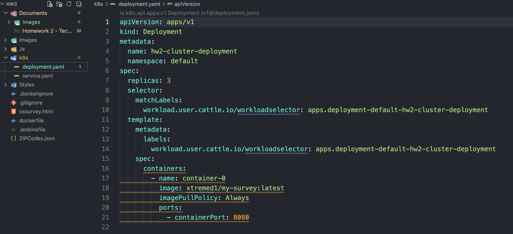
       
  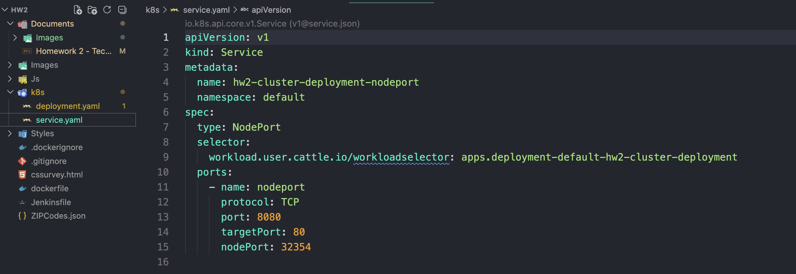
</div>

- In the same root as your html, create a file named **Jenkinsfile**. This is where you will create your **pipeline** with your **environment variables**, **stages** and **post** actions.

- Once you've created and saved deployment.yaml, service.yaml, and the Jenkins file, push these files to your github using git commands.

- In the Jenkins UI, you need to add your DockerHub credentials. Go to **Manage Jenkins** then **Credentials**, then **Add Credentials**. Click **Ussername with password** and then **Next**. Add your dockerhub username under **Username** (xtremed1) and then add your dockerhub password under **Password**. However, since I have 2FA on my DockerHub account, I needed to create a **Personal access token** in dockerhub and add that as my password. Then, give your credentials an ID and save it.

- Next, add your KubeConfig file to Jenkins under credentials. Download your KubeConfig file from Rancher. Click **Add Credentials** then click **Secret file** to upload your KubeConfig file. Then, give your credentials an ID and save it.

- Next, I added my Github credentials using the same process I used to add my dockerhub credentials.

- Finally, to set up the CI/CD pipeline on Jenkins:
  1. click **New Item**
  2. Provide a name in the **Enter an item name** textbox
  3. Select **Pipeline** then click **OK**
  4. Under **General** click GitHub project and enter your github repo url in the textbox
  5. Under **Triggers** select **Poll SCM** and enter `* * * * *` in the **Schedule** text area.
  6. Under **Pipeline** select **Pipeline script from SCM** under **Definition**, then select **Git** under **SCM**, paste your repository URL in the **Repository URL** textbox, select your github credentials in the **Credentials** box, then under **Script Path** type **Jenkinsfile**
  7. Click **Apply** and **Save**

- Your CI/CD should successfully build.
